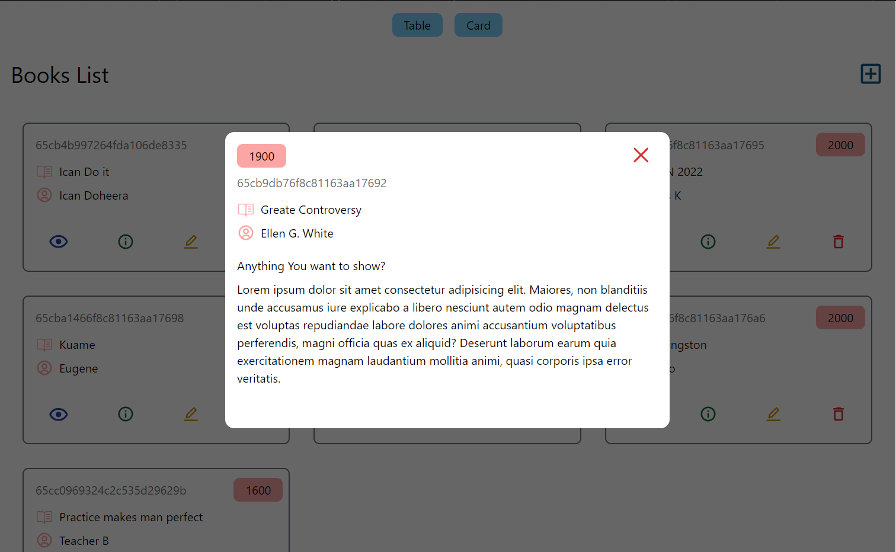

<a name="readme-top"></a>

<div align="center">
  <h1>📚 Evans Kupour's Bookstore Project</h1>
</div>





# 📗 Table of Contents

- [📖 About the Project](#about-project)
  - [🛠 Built With](#built-with)
    - [Tech Stack](#tech-stack)
    - [Key Features](#key-features)
  - [🚀 Live Demo](#live-demo)
- [💻 Getting Started](#getting-started)
  - [Setup](#setup)
  - [Prerequisites](#prerequisites)
  - [Install](#install)
  - [Usage](#usage)
  - [Run tests](#run-tests)
  - [Deployment](#deployment)
- [👥 Authors](#authors)
- [🔭 Future Features](#future-features)
- [🤝 Contributing](#contributing)
- [⭐️ Show your support](#support)
- [🙏 Acknowledgements](#acknowledgements)
- [❓ FAQ](#faq)
- [📝 License](#license)

# 📖 Evans Kupour's Bookstore Project <a name="about-project"></a>

Evans Kupour's Bookstore Project is a simple MERN (MongoDB, Express.js, React.js, Node.js) web application designed for managing and showcasing books.

## 🛠 Built With <a name="built-with"></a>

### Tech Stack <a name="tech-stack"></a>

<details>
  <summary>Client</summary>
  <ul>
    <li><a href="https://reactjs.org/">React.js</a></li>
    <!-- Add more client-side technologies if applicable -->
  </ul>
</details>

<details>
  <summary>Server</summary>
  <ul>
    <!-- Add server-side technologies if applicable -->
    <li><a href="https://expressjs.com/">Express.js</a></li>
  </ul>
</details>

<details>
<summary>Database</summary>
  <ul>
    <li><a href="https://www.mongodb.com/">MongoDB</a></li>
  </ul>
</details>

### Key Features <a name="key-features"></a>

- **CRUD Operations**: Users can create, read, update, and delete books.
- **Book Catalog**: Showcase a catalog of books with details like title, author, and publication year.

# 🚀 Live Demo <a name="live-demo"></a>

- [Live Demo Link](https://yourdeployedapplicationlink.com)

# 💻 Getting Started <a name="getting-started"></a>

To get a local copy up and running, follow these steps:

### Prerequisites

- Node.js
- MongoDB

### Setup

1. Clone this repository to your desired folder.

### Install

```bash
npm install
```

### Usage

```bash
npm start
```

### Run tests

```bash
npm test
```

### Deployment

Deploy your project using your preferred hosting service.

# 👥 Authors <a name="authors"></a>

👤 **Evans Kupour**

- GitHub: [@your-github-handle](https://github.com/your-github-handle)
- Twitter: [@your-twitter-handle](https://twitter.com/your-twitter-handle)
- LinkedIn: [Evans Kupour](https://www.linkedin.com/in/your-linkedin-handle)

# 🔭 Future Features <a name="future-features"></a>

- [ ] **User Profile Page**: Allow users to manage their profiles and preferences.
- [ ] **Search Functionality**: Implement a search feature to find books easily.

# 🤝 Contributing <a name="contributing"></a>

Contributions, issues, and feature requests are welcome!

# ⭐️ Show your support <a name="support"></a>

If you like this project...

# 🙏 Acknowledgements <a name="acknowledgements"></a>

Special thanks to Microverse for providing the template.


# 📝 License <a name="license"></a>

This project is [MIT](./LICENSE) licensed.
```